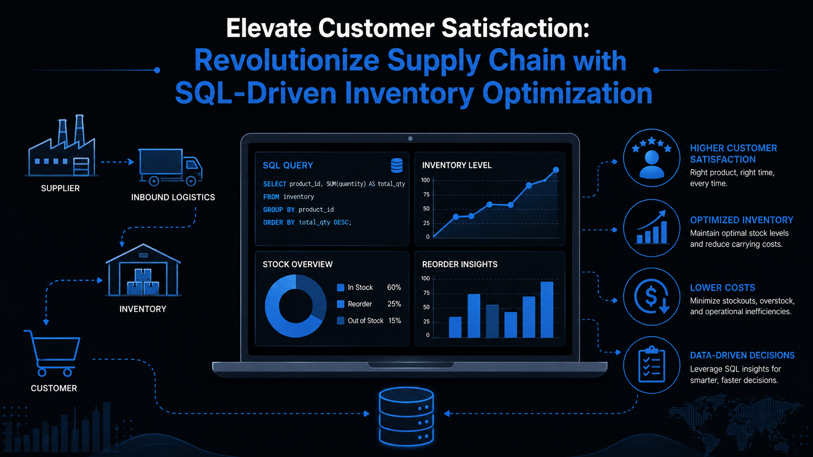

# Elevate Customer Satisfaction: Revolutionize Supply Chain with SQL-Driven Inventory Optimization

This project helps TechElectro Inc. optimize inventory using MySQL to address overstocking and stockouts, ensuring customer satisfaction, cost efficiency, and competitive advantage through data-driven inventory management strategies.

## Key learning points

`Intermediate/Advanced SQL` `Exploratory Data Analysis` `SQL Query Optimization`

`Inventory Level optimization` `Report Automation` `Reporting and Recommendations`

# Start project :

# Business Overview/Problem

TechElectro Inc. is a prominent player in the consumer electronics manufacturing and distribution sector, known for its worldwide recognition and leadership. The company has earned its reputation by offering an extensive range of technologically advanced products, ranging from state-of-the-art smartphones to innovative home appliances. This diverse product portfolio showcases TechElectro's commitment to meeting the evolving needs of consumers in the tech and electronics industry.

One of TechElectro's distinguishing features is its expansive global presence. Operating in numerous countries, the company has successfully extended its reach to a wide customer base, making it a truly international entity. This global footprint allows TechElectro Inc. to cater to the diverse preferences and demands of customers in various regions, further solidifying its position as an industry leader.

**Inventory Management Challenges:**

TechElectro Inc. faces a series of intricate inventory management challenges that impede its operational efficiency and customer satisfaction:

* **Overstocking** : The company frequently finds itself burdened with excessive inventory of certain products, resulting in substantial capital tied up in unsold goods and limited storage capacity.
* **Understocking** : Conversely, high-demand products regularly suffer from stockouts, leading to missed sales opportunities and irate customers unable to access their desired items.
* **Customer Satisfaction** : These inventory-related issues have a direct and detrimental effect on customer satisfaction and loyalty. Customers endure delays, frequent stockouts, and frustration when they cannot find the products they seek.

## Rationale for the Project

Inventory optimization refers to the process of efficiently managing a company's inventory to strike the right balance between supply and demand. The goal is to minimize carrying costs while ensuring that products are readily available to meet customer needs. Transforming customer satisfaction through SQL-powered inventory optimization is a strategic approach that uses SQL (Structured Query Language) and data analysis techniques to enhance customer satisfaction by efficiently managing inventory.

**Importance of MySQL-Powered Inventory Optimization:**

* Implementing a comprehensive inventory optimization system powered by MySQL is imperative for TechElectro Inc. due to several compelling reasons
* **Cost Reduction** : Efficient inventory management through MySQL can significantly reduce carrying costs associated with overstocked items, freeing up capital for strategic investments.
* **Enhanced Customer Satisfaction** : By maintaining optimal inventory levels, TechElectro Inc. ensures that its products are readily available, elevating the overall customer experience and fostering loyalty.
* **Competitive Advantage** : Streamlined inventory management empowers TechElectro Inc. to respond swiftly to market fluctuations and shifting customer demands, providing a competitive edge.
* **Profitability** : Improved inventory control through MySQL optimization leads to reduced waste and improved cash flow, directly impacting profitability.

## Aim of the Project

The primary objectives of this project are to implement a sophisticated inventory optimization system utilizing MySQL and address the identified business challenges effectively. The project aims to achieve the following goals:

* A. **Optimal Inventory Levels:** Utilize MySQL optimization techniques to determine the optimal stock levels for each product SKU, thereby minimizing overstock and understock situations.
* B.  **Data-Driven Decisions** : Enable data-driven decision-making in inventory management by leveraging MySQL analytics to reduce costs and enhance customer satisfaction.

## Data Description

| **Column Name**                 | **SQL Data Type** | **Primary Role & Description**                   | **Example Value** | **Business Relevance**                                              |
| ------------------------------------- | ----------------------- | ------------------------------------------------------ | ----------------------- | ------------------------------------------------------------------------- |
| **`Date`**                    | `DATE`                | Daily timestamp for each observation record.           | `2024-01-01`          | Establishes time-series granularity across 365 calendar days.             |
| **`SKU_ID`**                  | `VARCHAR(20)`         | Unique product identifier for inventory items.         | `SKU_1`               | Enables SKU-level stock optimization and sales performance tracking.      |
| **`Warehouse_ID`**            | `VARCHAR(20)`         | Unique identifier for physical distribution hubs.      | `WH_1`                | Facilitates multi-warehouse inventory distribution and load balancing.    |
| **`Supplier_ID`**             | `VARCHAR(20)`         | Unique identifier for component suppliers.             | `SUP_8`               | Tracks vendor fulfillment performance and order allocation.               |
| **`Region`**                  | `VARCHAR(50)`         | Geographic territory of the warehouse network.         | `West`                | Groups inventory trends by regional market demand.                        |
| **`Units_Sold`**              | `INT`                 | Actual number of units purchased by customers daily.   | `10`                  | Serves as the primary demand metric for sales and revenue analysis.       |
| **`Inventory_Level`**         | `INT`                 | Total on-hand physical stock available at day's end.   | `592`                 | Core variable used to measure overstocking and understocking risks.       |
| **`Supplier_Lead_Time_Days`** | `INT`                 | Days required for supplier replenishment to arrive.    | `14`                  | Critical parameter for calculating safety stock and reorder thresholds.   |
| **`Reorder_Point`**           | `INT`                 | Minimum stock threshold that triggers a restock order. | `379`                 | Benchmark threshold for automated inventory replenishment triggers.       |
| **`Order_Quantity`**          | `INT`                 | Volume of inventory ordered for replenishment.         | `0`                   | Measures active stock replenishment activity.                             |
| **`Unit_Cost`**               | `DECIMAL(10,2)`       | Procurement/production cost per single item unit.      | `13.95`               | Determines holding costs, cost of goods sold (COGS), and tied-up capital. |
| **`Unit_Price`**              | `DECIMAL(10,2)`       | Selling price charged to end customers per unit.       | `20.48`               | Used to calculate total revenue, gross margin, and stockout impact.       |
| **`Promotion_Flag`**          | `TINYINT(1)`          | Binary indicator (`1`= Active,`0`= Inactive).      | `0`                   | Identifies promotional periods that drive demand spikes.                  |
| **`Stockout_Flag`**           | `TINYINT(1)`          | Binary indicator (`1`= Stockout,`0`= Available).   | `0`                   | Flags occurrences where demand exceeded available inventory.              |
| **`Demand_Forecast`**         | `DECIMAL(10,2)`       | Estimated unit sales predicted by planning models.     | `8.52`                | Evaluates forecast accuracy (MAPE) against actual`Units_Sold`.          |

* **slToollsDate:** Daily timestamps spanning one year of activity.
* **SKU-Level Detail:** Unique product identifiers with varying demand patterns.
* **Warehouse and Region:** Spatial dimensions representing distribution networks.
* **Units Sold:** Simulated sales data with seasonal trends and random noise.
* **Inventory Levels:** Dynamic on-hand stock that evolves over time.
* **Supplier Lead Times:** Variable delivery delays for replenishment orders.
* **Reorder Points and Quantities:** Inventory policy thresholds and simulated replenishments.
* **Promotions:** Binary indicator of promotional periods influencing demand.
* **Stockout Events:** Flags indicating when demand exceeds available inventory.
* **Supplier Information:** Links products to specific suppliers with unique lead times.
* **Cost and Price:** Realistic unit costs and selling prices with profit margins.
* **Forecasted Demand:** Approximate prediction values reflecting planning estimates.

**Dataset Structure Overview**

| **Field Category**       | **Dataset Columns**                                                  | **Analytical Utility**                                                               |
| ------------------------------ | -------------------------------------------------------------------------- | ------------------------------------------------------------------------------------------ |
| **Spatial & Time**       | `Date`,`Warehouse_ID`,`Region`                                       | Granular daily time-series analysis across 5 warehouses and 4 regions.                     |
| **Product & Vendor**     | `SKU_ID`,`Supplier_ID`                                                 | Multi-level SKU breakdown (50 unique SKUs) across 10 distinct suppliers.                   |
| **Inventory & Orders**   | `Inventory_Level`,`Reorder_Point`,`Order_Quantity`,`Stockout_Flag` | SQL logic testing for inventory depletion, stockout risks, and automated reorder triggers. |
| **Financial & Forecast** | `Unit_Cost`,`Unit_Price`,`Demand_Forecast`,`Promotion_Flag`        | Calculating profit margins, demand variances, and inventory carrying cost optimizations.   |

## Tech Stack

Tool– MySQL will be used for:

A. For performing mathematical operations over data

B. For Data Analysis and Manipulation

## Project Scope

* **Exploratory Data Analysis (EDA)** : Leverage MySQL for EDA, conducting advanced analytics and statistical analysis to explore data patterns, correlations, and descriptive statistics without relying on data visualization.
* **Optimal Inventory Levels** : Utilize MySQL optimization techniques and algorithms to determine optimal inventory levels for each product SKU.
* **Documentation and Recommendations** : Develop comprehensive documentation of the project, encompassing MySQL scripts, methodologies, and user guides.
* **Deployment** : Deploy the MySQL-powered inventory optimization system, ensuring seamless integration with TechElectro Inc.'s existing supply chain management systems.
* **Exploratory Data Analysis** : Explore the data to understand its characteristics and discover patterns.
* **Data Transformation** : Prepare the data for analysis by transforming, encoding, or normalizing it.
* **Data Analysis** : Analyze data to understand pattern in order to generate insights that will be visualized.
* **Data Visualization** : Create visual representations to communicate insights effectively.
* **Interpretation and Insight Generation** : Extract meaningful insights and interpret the results.
